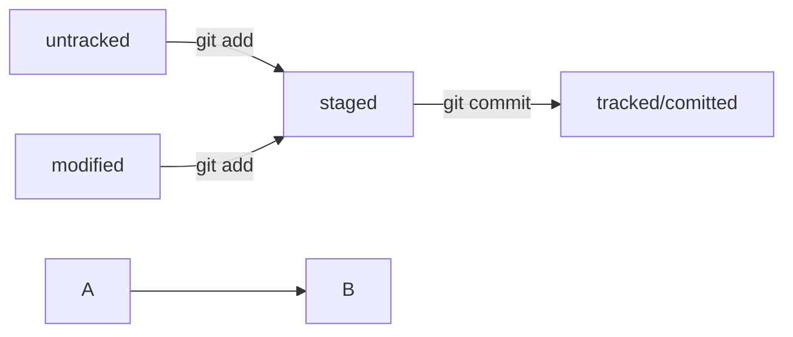

# first project  
---  
## chapter 1  
aboba  
abeme <br>


## chapter 2  
lal  
*Cursiv*  
**Jirniy**  
__Jirniy2__  
~~Zacherk~~


## chapter 3  
1. first  
2. second  
3. 4 (6)  
* bomba  
* asdf  
[YPEC](https://www.ypec.ru "Privet ypec")  


## chapter 4  
```python  
print("Hello world")  
```  
  
```bash  
rm -r C:/  
```  
---  

